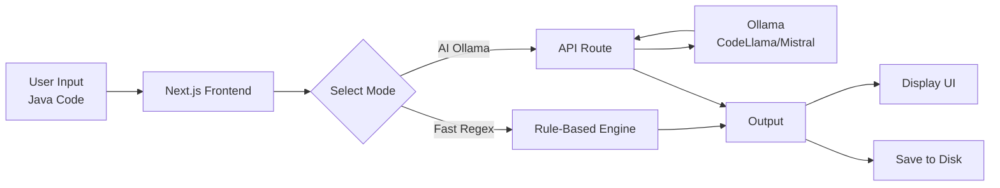

# Selenium to Playwright Converter (AI-Powered)

🚀 **A Next.js Web Application that converts Selenium Java code into Playwright TypeScript.**

This tool offers two powerful conversion modes:
1.  ⚡ **Fast Mode (Heuristic/Regex)**: Instant conversion for standard Selenium patterns using rule-based logic.
2.  🤖 **AI Mode (Ollama)**: Intelligent conversion using local LLMs (e.g., `codellama`) to handle complex logic and context.

## 🏗️ Architecture



## ✨ Features
- **Dual Mode**: Switch between speed and intelligence.
- **Privacy First**: All data stays local (Localhost + Local LLM).
- **Modern UI**: Built with React, TailwindCSS, and Lucide Icons.
- **Direct File Saving**: Persist converted tests directly to your filesystem.

## 🛠️ Prerequisites
1.  **Node.js**: v18+
2.  **Ollama**: [Download Ollama](https://ollama.com)
3.  **AI Models**: Run `ollama pull codellama` or `ollama pull mistral`

## 🚀 Getting Started

1.  **Clone the Repository**
    ```bash
    git clone https://github.com/Ravikumar191179/Conversion-of-Selenium-code-to-Playwright.git
    cd web-app
    ```

2.  **Install Dependencies**
    ```bash
    npm install
    ```

3.  **Run the App**
    ```bash
    npm run dev
    ```

4.  **Open in Browser**
    Visit [http://localhost:3000](http://localhost:3000)

## 🤝 Contributing
Feel free to open issues or submit PRs to improve the heuristic engine or AI prompts!
